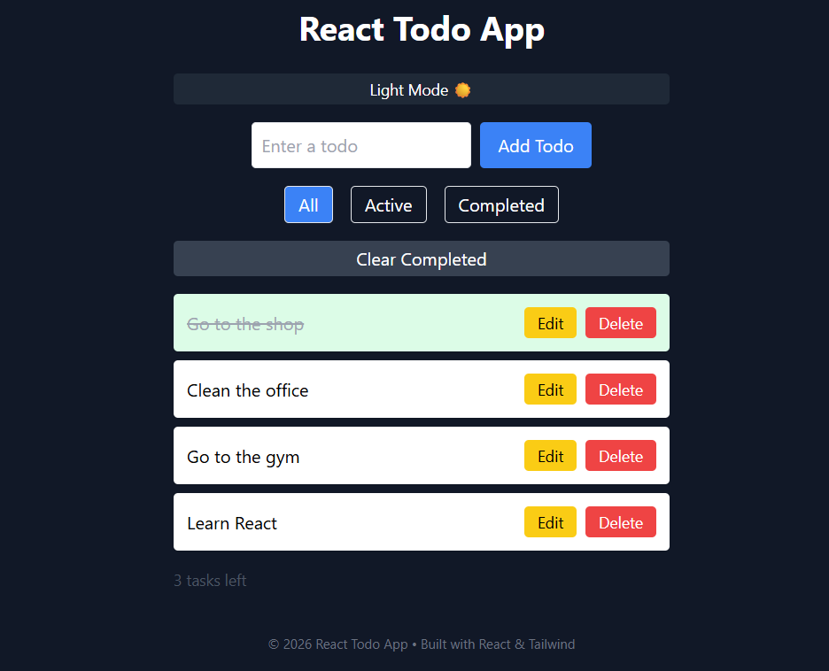

📝 React Todo App
A clean and responsive Todo App built with React and Tailwind CSS.
🚀 Features
➕ Add new todos
✏️ Edit todos inline (without popup)
❌ Delete todos
✅ Toggle completed state
🔍 Filter tasks (All / Active / Completed)
🌙 Dark Mode toggle
💾 Persistent data using Local Storage
📱 Fully responsive layout
🧠 What I Practiced
React Hooks (useState, useEffect)
Component-based architecture
Handling user input and events
Conditional rendering
UI state management
Responsive design with Tailwind
Dark mode styling
🛠️ Tech Stack
React
Tailwind CSS
JavaScript (ES6)
▶️ Getting Started
git clone https://github.com/A95-M/react-todo-app.git
cd react-todo-app
npm install
npm start
App runs on: http://localhost:3000
📸 Preview


📌 Notes
This project was built as a hands-on practice to improve my React skills by implementing a real-world UI with multiple features.
✨ Future Improvements
Animations (smooth transitions)
Drag & drop todos
Backend integration (API)
🚀 Built with React & Tailwind CSS